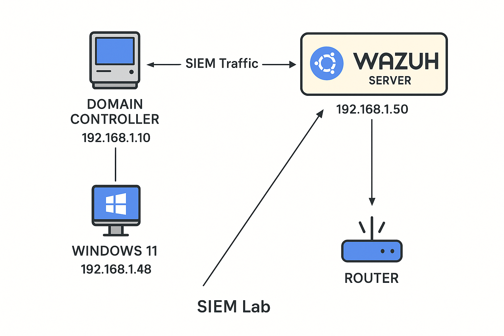
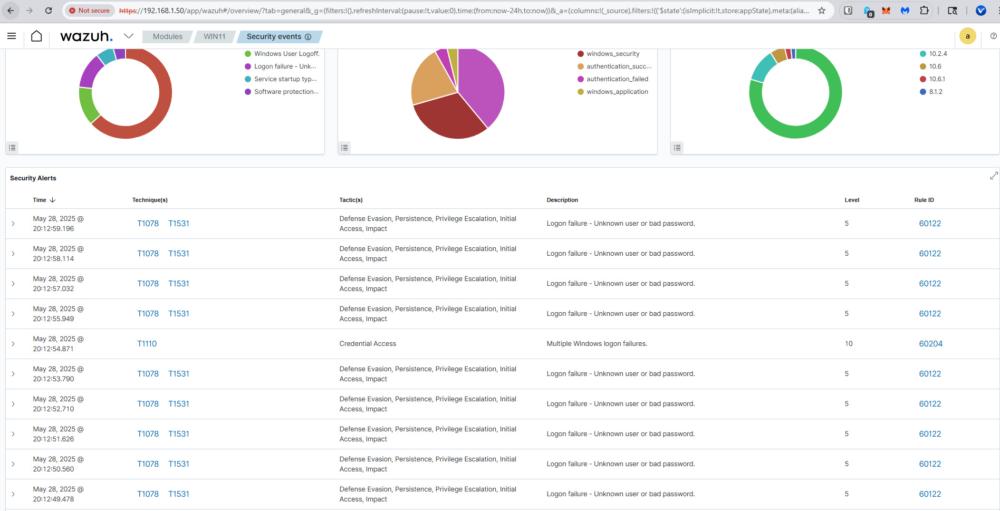
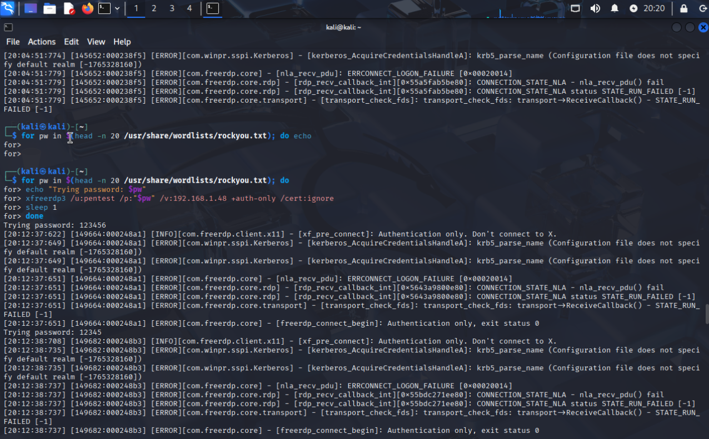

# RDP Brute-Force Lab

## Overview
Simulated brute-force RDP login attempts on a Windows 11 VM and monitored detection using Wazuh SIEM.

## Environment
- Kali Linux attacker
- Windows 11 target (192.168.1.48)
- Wazuh SIEM server

## Attack Method
Used `xfreerdp3` with the `rockyou.txt` wordlist for 20 password attempts.

## Detection Results
- Windows Event Viewer logs (Event ID 4625, Logon Type 3)
- Wazuh alerts escalated to Level 10 for multiple failed logins

## Screenshots
### Detection Flow Diagram
![Brief Flow Diagram 
### Windows Event Viewer Logs

### Wazuh Alerts

### Kali Brute-force loop command

## Conclusion
Successfully simulated brute-force detection. This lab helped reinforce understanding of Windows logon events and SIEM alerting.
